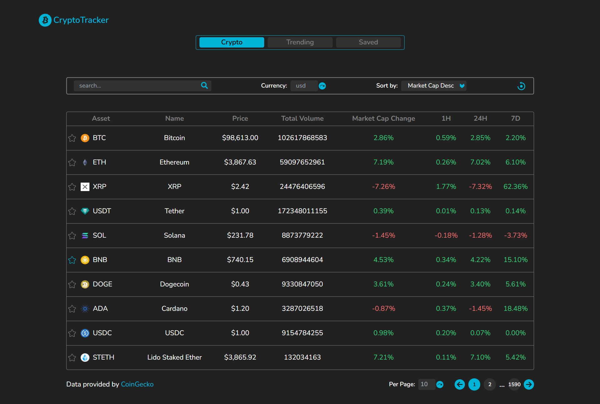

# CryptoTracker Web App 🌟

A Crypto Tracker App using **Next.js** & **Tailwind CSS**. It shows details regarding almost all cryptocurrencies. You can easily convert the price in your local currency.

**Live Link:** [CryptoTracker](https://crypto-tracker-ten-taupe.vercel.app/)

---

## 🛠 Features

- **Real-Time Data**: Fetch live cryptocurrency data by Axios from the CoinGecko API.
- **Search, Sort, and Filter**: Quickly find and organize cryptocurrencies.
- **Trending Page**: Displays currently trending cryptocurrencies.
- **Save**: Save cryptocurrencies to monitor their prices later.
- **Interactive Charts**: Visualize data trends with beautiful and interactive charts using Recharts.
- **Currency Conversion**: View prices in your local currency.
- **Mobile Responsive**: Responsive for all devices.

---

## 🚀 Tech Stack

- **Next.js**
- **Tailwind CSS**
- **Context API**
- **Recharts**
- **CoinGecko Cryptocurrency APIs**

---

## 📸 Screen

  
  

<!-- 

 -->

